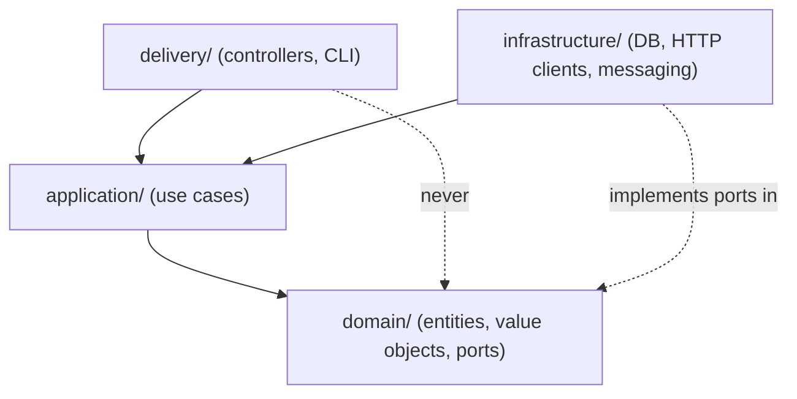

# Pattern — Clean architecture scaffold

Anchors: P2, P13, P14, T1

Directory layout and dependency rules for a new Spring Boot service following clean architecture.

## Dependency direction



Dependencies point inward. Domain depends on nothing. Application depends only on domain. Delivery and infrastructure depend on application (and domain via application).

## Directory structure

```text
src/main/java/com/example/invoicing/
├── domain/                # Entities, value objects, Result types, port interfaces
│   ├── model/             # Aggregates, entities, value objects
│   └── port/              # Interfaces that infrastructure implements
├── application/           # Use cases — orchestrate domain, call ports
│   └── usecase/
├── infrastructure/        # Adapters: repositories, HTTP clients, message publishers
│   ├── persistence/       # JPA / JDBC implementations of domain ports
│   ├── messaging/         # Broker adapters
│   └── client/            # HTTP clients for external services
├── delivery/              # Inbound adapters: REST controllers, event listeners
│   ├── rest/
│   └── listener/
└── config/                # Composition root — Spring @Configuration classes
```

## What goes where

| Layer | Contains | Imports from |
| --- | --- | --- |
| `domain/` | Entities, value objects, `Result<T,E>`, port interfaces, domain events | Nothing outside this package |
| `application/` | Use-case classes; one public method per use case | `domain/` only |
| `infrastructure/` | Adapters that implement domain ports (repos, clients, publishers) | `domain/`, `application/` |
| `delivery/` | REST controllers, event listeners, CLI commands | `application/`, `domain/` (for DTOs → domain mapping) |
| `config/` | Composition root — wires adapters to ports | All layers (it is the only place that knows about concrete types) |

## Composition root

The composition root is the only place that constructs adapters and binds them to ports. In Spring Boot this is one or more `@Configuration` classes in `config/`:

```java
@Configuration
class InvoicingConfig {
    @Bean
    CreateInvoiceUseCase createInvoiceUseCase(InvoiceRepository repo, EventPublisher pub) {
        return new CreateInvoiceUseCase(repo, pub);
    }
}
```

Use cases receive ports (interfaces), not concrete adapters. The composition root wires the concrete adapter.

## Architecture test skeleton

Add an ArchUnit test to enforce the rules mechanically (P14). See `architecture-tests.md` for the full recipe.

```java
@AnalyzeClasses(packages = "com.example.invoicing")
class LayerBoundariesTest {
    @ArchTest
    static final ArchRule domain_has_no_outward_deps = noClasses()
        .that().resideInAPackage("..domain..")
        .should().dependOnClassesThat()
        .resideInAnyPackage("..application..", "..infrastructure..", "..delivery..", "..config..");

    @ArchTest
    static final ArchRule application_depends_only_on_domain = noClasses()
        .that().resideInAPackage("..application..")
        .should().dependOnClassesThat()
        .resideInAnyPackage("..infrastructure..", "..delivery..", "..config..");
}
```

## Made Tech variant vs Uncle Bob

The Made Tech clean-architecture variant uses the same dependency rule but names the layers differently and emphasises domain-driven design (P1) within the domain layer. The key differences:

- **Ports live in `domain/`**, not in a separate `interfaces/` layer. Infrastructure implements them.
- **Use cases are the application layer**, not interactors — the name is more direct.
- **No separate "entities" layer** — entities are part of the domain, alongside value objects and aggregates.

The dependency rule is the same in both. Use whichever naming the team has adopted; enforce it with architecture tests either way.

## References

- Constitution P2 (clean architecture), P13 (domain modelling), P14 (mechanical enforcement)
- Tech Stack T1 (Spring Boot / Java / Postgres default)
- `architecture-tests.md` — enforcement recipe
- Made Tech clean architecture: https://github.com/madetech/clean-architecture
