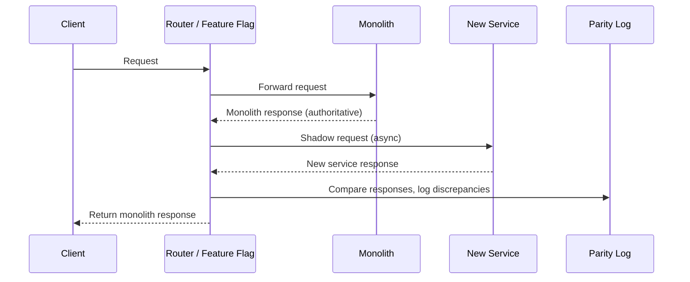

# Pattern — Strangler-fig extraction from a monolith

Recipe for moving a bounded context out of a monolith into a new service.

## Steps

1. **Identify the bounded context.** Name the verb the consumer wants. The verb defines the use case; the use case defines the service boundary.
2. **Create the new repo.** Default stack (see `principles/tech-stack.md`), hexagonal layout, plugin installed.
3. **Define the canonical shape** (Constitution P1, Tech Stack T3). Resist mirroring the monolith's schema; emit the domain language.
4. **Set up the narrow read contract.** Read-replica access scoped to the specific tables the new service needs. No writes. No coupling to transitive components of the monolith (rules engines, processors, code-gen).
5. **Own the side-effect surface.** New datastore for the new service's idempotency, mapping, and audit needs. Never mutate monolith tables from the new service.
6. **Dual-run.** New service runs alongside the old surface behind a feature flag. Compare outputs (shadow-mode parity harness).
7. **Switch reads.** Consumers point at the new service. Flag flipped per tenant for gradual rollout.
8. **Decommission.** Retire the old surface only after two clean cutover windows.

## What not to do

- Don't extend the monolith with a new HTTP surface "as a stepping stone" — that's reinforcement, not extraction.
- Don't dual-write from the new service into the monolith. The monolith is the source of truth until cutover; after cutover, the monolith data is migrated and the source flips.
- Don't generalise across multiple extractions prematurely. Three concrete extractions, then look for the shared pattern.

## Dual-run / shadow-mode flow

During shadow mode, the monolith response is always the one returned to the client. The new service runs in parallel for comparison only. After the parity harness shows consistent results, switch the authoritative source.

## Parity harness

The parity harness compares the monolith and new service responses field by field. What to compare and how:

| Aspect | Approach |
| --- | --- |
| **Response body** | Deep-compare JSON fields. Ignore fields the new service intentionally changes (e.g. new field names, different date formats). |
| **Timing differences** | The new service may be faster or slower. Log latency delta but do not treat it as a parity failure. |
| **Ordering** | If the response is a list, sort both before comparing unless ordering is part of the contract. |
| **Generated values** | IDs, timestamps, and nonces will differ. Exclude them from comparison or compare structure only. |

Log discrepancies to a dedicated parity log (structured, queryable). Include: request ID, field path, monolith value, new service value, timestamp. Review discrepancies daily during the dual-run phase.

**Exit criteria for shadow mode:** zero unexplained discrepancies over two full business cycles (e.g. two billing periods, two payroll runs).

## Concrete example — extracting invoicing

1. **Bounded context identified:** "Create and retrieve invoices." The monolith has invoicing logic spread across three modules — billing, PDF generation, and tax calculation.
2. **New repo created:** `invoicing-service`, Spring Boot, hexagonal layout, plugin installed.
3. **Canonical shape defined:** `Invoice` aggregate with `LineItem` value objects. The new service emits `InvoiceCreated` events (CloudEvents envelope). Does not mirror the monolith's `billing_records` table.
4. **Narrow read contract:** Read-replica access to `invoices` and `line_items` tables only. No access to `billing_engine_state` or `tax_rule_cache`.
5. **Own side-effect surface:** New Postgres database for the invoicing service. Idempotency keys stored locally. PDF storage in the service's own S3 bucket.
6. **Dual-run:** Feature flag `invoicing-v2-shadow` enabled per tenant. Parity harness compares invoice totals, line item counts, and tax calculations. PDF layout differences are logged but not treated as failures.
7. **Switch reads:** After 2 billing cycles with zero unexplained discrepancies, flip `invoicing-v2-active` per tenant. Gradual rollout over 2 weeks.
8. **Decommission:** After all tenants are on the new service and two clean billing cycles have passed, retire the monolith's invoicing modules. Remove read-replica access.

## References

- Tech Stack T2 (monolith decomposition stance)
- Constitution P1 (DDD bounded contexts), P3 (small slices), P9 (feature flags)
- `event-driven-outbox.md` — for the event publication from the new service
