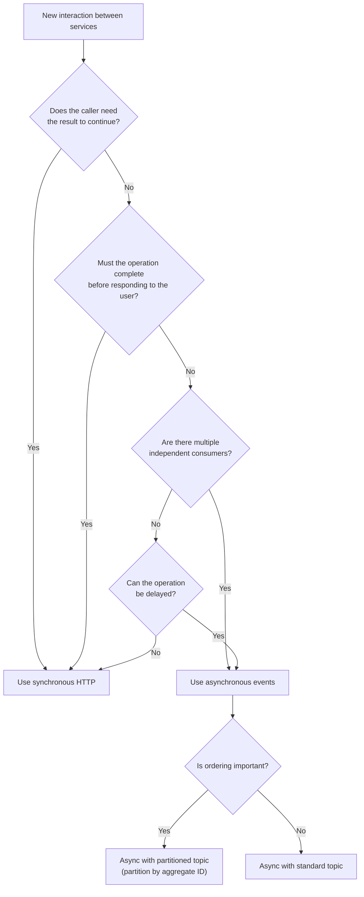

# Pattern — Sync vs async decision

Anchors: P10

A decision tree for choosing synchronous HTTP vs asynchronous events for a given interaction.

## Decision tree

## Quick reference

| Signal | Points to |
| --- | --- |
| Caller blocks until it has the answer | Sync |
| User is waiting for the response | Sync |
| Multiple services react to the same event | Async |
| The work can happen seconds or minutes later | Async |
| The producer should not know about consumers | Async |
| Order matters within an aggregate | Async with partitioned topic |

## Common mistakes

- **Events for everything.** Introducing async events between two services where one always needs a synchronous answer adds complexity (outbox, idempotency, eventual consistency) without benefit. If the caller blocks on the result, use HTTP.
- **Sync for fire-and-forget.** If the caller does not need the result and the operation can fail independently, a synchronous call couples the caller's availability to the downstream. Use an event.
- **Async without idempotency.** At-least-once delivery means consumers must handle duplicates (P6). Forgetting this leads to double-processing.
- **Choosing async to avoid fixing a slow dependency.** If the real problem is a slow downstream, async hides the latency but does not fix it. Fix the dependency first (P4 — root cause).

## Implementation

- For the async path, use the outbox pattern to make the state change and event publish atomic. See `event-driven-outbox.md`.
- For the sync path, apply timeouts, retries, and circuit breakers. See `timeouts-and-retries.md` and `circuit-breaker-setup.md`.

## References

- Constitution P10 (event-driven where the domain warrants it)
- `event-driven-outbox.md` — async implementation
- `timeouts-and-retries.md` — sync resilience
